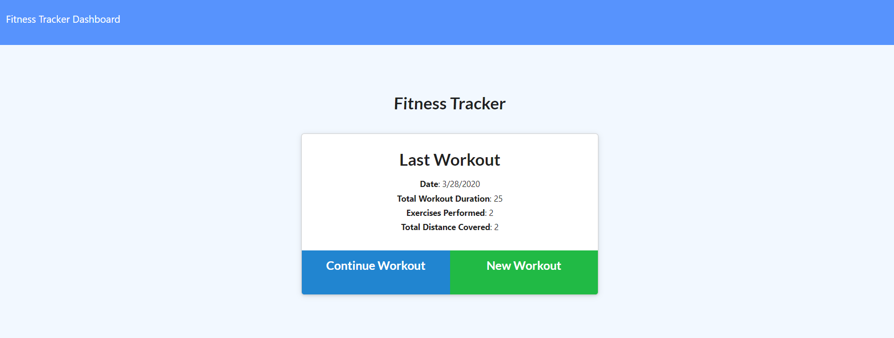
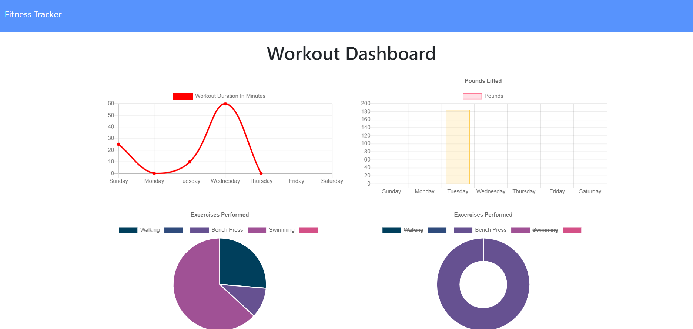
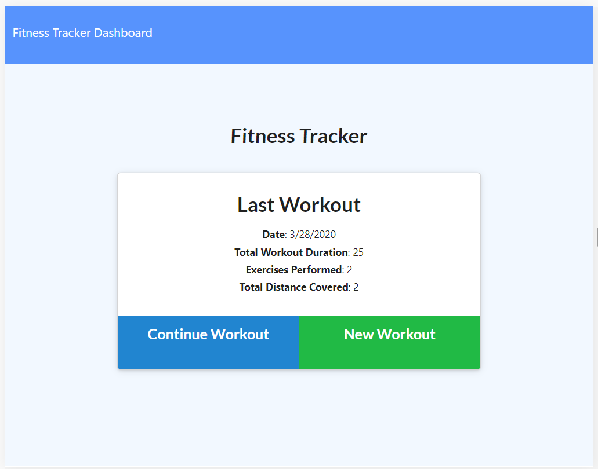
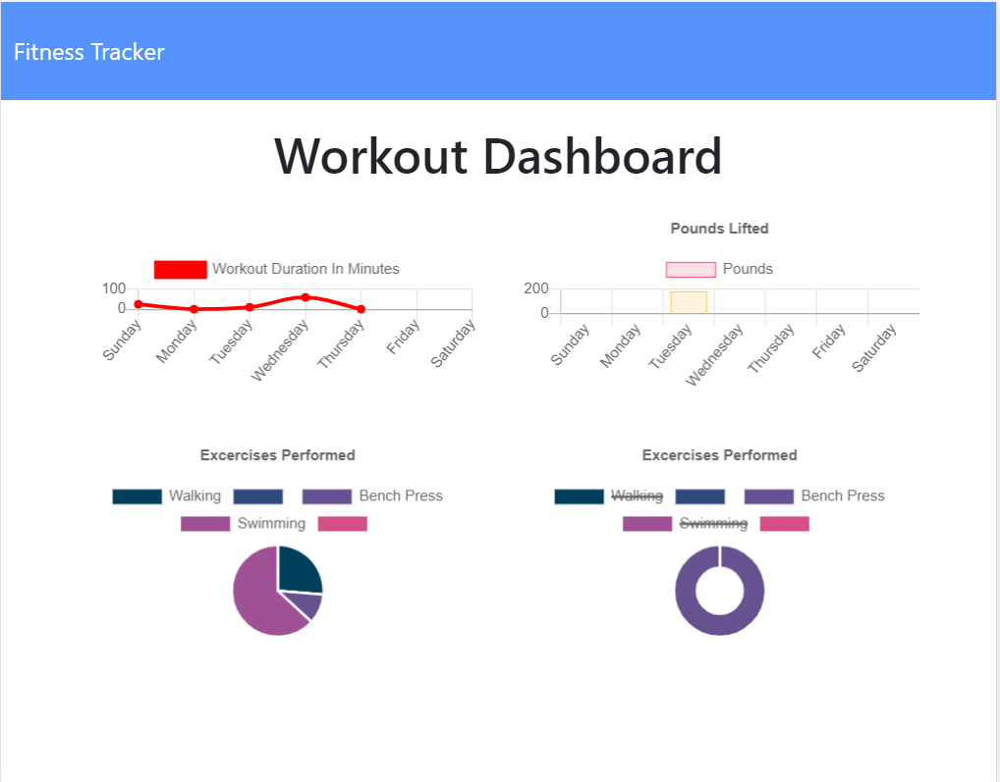

# Fitness-Tracker
An application that helps you visually track your fitness with charts that update as you input information.

Deployment Link: (https://shrouded-ridge-77681.herokuapp.com/)

# Browser View of Application

# Mobile View of Application

# Purpose
I built this application to get more experience with the backend, and use a non-SQL database.
I built the backend database using Mongo with a Mongoose schema and handle routes with Express.

## User Story

* As a user, I want to be able to view create and track daily workouts. I want to be able to log multiple exercises in a workout on a given day. I should also be able to track the name, type, weight, sets, reps, and duration of exercise. If the exercise is a cardio exercise, I should be able to track my distance traveled.

## Business Context

A consumer will reach their fitness goals quicker when they track their workout progress.

## Future Improvements 

- Revamp color scheme
- Add code to prevent an incomplete or blank exercise to the workout -- add it to the Complete onclick